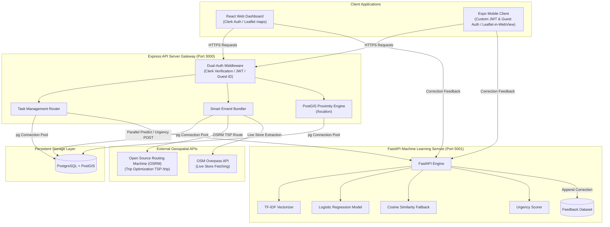
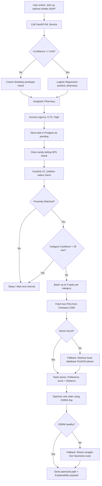

# 🗺️ GeoMind — Context-Aware Geospatial Task Orchestration Platform

GeoMind is a proactive, context-aware geospatial task orchestration platform that dynamically tracks user context and intent to optimize errand running. 

Instead of requiring users to manage rigid, location-static to-do lists, GeoMind allows them to record raw thoughts (e.g., *"pick up asthma inhaler before dinner"*). The platform parses this input to infer task categories and urgency levels, matches them against real-world points of interest, batches tasks by location category, and computes optimal travel paths.

---

## 🏗️ System Architecture



---

## 🔄 Core Errand Lifecycle & Routing Workflow



---

## 🛠️ Detailed Component Deep Dive

### 1. Dual-Authentication Pipeline
The Express gateway intercepts traffic using a unified custom middleware. This pipeline dynamically detects the authentication source:
1. **Web Client:** Resolves identity by validating the session token issued by **Clerk** (cookie-based/JWT validation).
2. **Mobile Client (Registered):** Validates a standard **HMAC-SHA256 JWT** containing `{ userId, source: "mobile" }` under the `Authorization: Bearer <token>` header.
3. **Mobile Client (Guest Mode):** Detects `X-Guest-ID` (matching `guest_[A-Za-z0-9_-]{8,80}`) and routes tasks to sandbox records, allowing zero-friction onboarding.

### 2. PostGIS Geospatial Engine (`/location`)
Proximity matches avoid CPU-heavy JS calculations by delegating geospatial operations directly to PostGIS:
* Spatial proximity is verified via coordinates matching:
  ```sql
  ST_DWithin(geom, ST_GeogFromText('POINT(lng lat)'), task.radius_meters)
  ```
* Distance queries employ spatial indices (`idx_places_geom` USING GIST) to fetch nearby stores matching the category and user ownership (`user_id = $userId OR user_id IS NULL`).
* Individual per-task cooldowns (`cooldown_minutes`) and a 30-minute per-category cooldown prevent notification spam.

### 3. Smart Outing Errand Router & OSRM TSP Solver
* **Aggregation:** Groups pending tasks into categorical errands.
* **Store Harvesting:** Queries Overpass OSM endpoints in parallel. If OSM is offline, it falls back to querying the local PostGIS `places` database.
* **Lightweight Preference Learning:** Completing tasks logs store names and user ratings to `user_habits`. The routing engine scores stores dynamically based on frequency and ratings:
  $$\text{Score} = \min(1.0, \text{visits} \times 0.15 + \max(0, \text{rating} - 3) \times 0.2)$$
  Preferred stores bubble up to the top of the bundle routing list.
* **Route Optimization (OSRM):** Prepend the user's GPS coordinates to the coordinates of the chosen stores and posts them to OSRM `/trip` (Traveling Salesperson Problem solver) to return a road-optimized travel route (GeoJSON geometry and leg-by-leg durations). OSRM failures fall back to straight-line Haversine routing.

### 4. NLP Task Categorizer & Urgency Engine
* **Preprocessing:** Preprocessing is entirely offline-safe (does not trigger runtime corpus downloads). It normalizes inputs, filters stop words (preserving negations like *"no"*, *"not"*), and lemmatizes tokens.
* **Intent Classification:** Employs a TF-IDF vectorizer to extract unigrams and bigrams, coupled with L2-regularized Logistic Regression.
* **Cosine Similarity Fallback:** If prediction confidence falls below `0.60`, a cosine similarity fallback compares the task vector against pre-built category prototypes (centroid vectors of clean training data) to assign a classification label.
* **Urgency Scorer:** Computes an urgency coefficient (0.0 to 1.0) using a tiered keyword mapping (Critical = `0.45`, High = `0.30`, Mild = `0.15`) plus time-decay nudges (tasks older than 3 days receive a small urgency boost).

---

## 📈 ML Service Performance & Hardened Benchmarks

We enriched the training dataset with false-positive general sentences (e.g. *"go outside"*, *"handle work"*) and mixed-category phrases to optimize classification performance:
* **Total Samples:** `611 rows`
* **Test Split:** 123 samples (stratified 80/20 train/test split)
* **Accuracy:** **90.24%**
* **Macro F1-Score:** **90.59%**
* **Class Precision & Recall:**
  - **Grocery:** Precision `82.9%` | Recall `94.4%` | F1 `88.3%`
  - **Pharmacy:** Precision `86.1%` | Recall `93.9%` | F1 `89.9%`
  - **Clothing:** Precision `100.0%` | Recall `88.0%` | F1 `93.6%`
  - **General:** Precision `100.0%` | Recall `82.8%` | F1 `90.6%`

Detailed evaluation logs and matrix reports are saved to [ml/evaluation_report.md](file:///Users/srinivasch/Documents/Projects/Geomind/ml/evaluation_report.md).

---

## 📥 Getting Started

### Prerequisites
* **Node.js** (v18+)
* **Python** (3.9+)
* **PostgreSQL** with the **PostGIS** extension installed

### 1. Database Setup
Create your database and run the migrations/seed scripts:
```bash
createdb geomind
psql -d geomind -c "CREATE EXTENSION IF NOT EXISTS postgis;"
psql -d geomind -f server/migrations/001_phase1_smart_errand.sql
psql -d geomind -f server/seed.sql
```

### 2. Express Server Setup
Navigate to the server directory, create your environment configuration, and boot the server:
```bash
cd server
npm install
cp .env.example .env # Set your DATABASE_URL, JWT_SECRET, and CLERK_API_KEY
npm start
```

### 3. FastAPI ML Setup
Initialize the Python environment, install dependencies, train the classifier, and run Uvicorn:
```bash
cd ml
python3 -m venv .venv
source .venv/bin/activate
pip install -r requirements.txt
python3 train.py
python3 evaluate.py # Generates evaluation_report.md
python3 app.py
```

### 4. React Web Dashboard Setup
Start the dashboard frontend:
```bash
cd web
npm install
npm start
```

### 5. Expo Mobile Client Setup
Initialize and run the Expo client:
```bash
cd mobile
npm install
npx expo start
```

---

## 📡 API Contract Specification

### `GET /api/smart-bundle`
* **Query Params:** `lat` (float), `lng` (float), `radius` (integer, default 2000)
* **Response (Annotated JSON):**
  ```json
  {
    "bundles": [
      {
        "category": "grocery",
        "best_store": {
          "id": "1",
          "name": "D-Mart Civil Lines",
          "lat": 25.4540,
          "lng": 81.8340,
          "distance_m": 180,
          "preference_score": 0.95,
          "source": "local_postgis"
        },
        "tasks": [
          {
            "id": 12,
            "text": "buy organic milk",
            "priority": "high",
            "urgency_score": "0.78",
            "urgency_reason": "urgently, running out"
          }
        ],
        "task_count": 1,
        "avg_urgency": 0.78,
        "store_found": true,
        "explainability": [
          "D-Mart Civil Lines is close (180m away)",
          "Priority level: High",
          "Urgency: High (78%)",
          "Frequently visited store from completion history"
        ]
      }
    ],
    "route": {
      "ordered_stops": [
        { "name": "D-Mart Civil Lines", "lat": 25.4540, "lng": 81.8340 }
      ],
      "geometry": [
        [25.4322, 81.7707],
        [25.4540, 81.8340]
      ],
      "total_distance_m": 180,
      "total_time_min": 2
    }
  }
  ```

### `GET /health`
* **Response (Diagnostics):**
  ```json
  {
    "status": "healthy",
    "timestamp": "2026-07-03T17:46:40.000Z",
    "services": {
      "database": "healthy",
      "ml_service": "healthy",
      "osrm_router": "configured (default)",
      "overpass_osm": "configured (default failover pool)"
    }
  }
  ```

---

## 📝 Database Schema Detail

```sql
-- Core Tasks table
CREATE TABLE IF NOT EXISTS smart_tasks (
  id               SERIAL PRIMARY KEY,
  user_id          TEXT NOT NULL,
  raw_text         TEXT NOT NULL,
  category         VARCHAR(50),
  priority         VARCHAR(10) DEFAULT 'medium',
  status           VARCHAR(20) DEFAULT 'pending',
  radius_meters    INT DEFAULT 1000,
  urgency_score    FLOAT DEFAULT 0.5,
  urgency_reason   TEXT DEFAULT NULL,
  triggered_at     TIMESTAMP,
  created_at       TIMESTAMP DEFAULT NOW(),
  cooldown_minutes INT DEFAULT 30
);

-- Stored Places
CREATE TABLE IF NOT EXISTS places (
  id          SERIAL PRIMARY KEY,
  user_id     TEXT DEFAULT NULL,
  name        TEXT,
  category    VARCHAR(50),
  price_level INT DEFAULT NULL,
  rating      FLOAT DEFAULT NULL,
  geom        geometry(Point, 4326)
);

-- User habits/history tracking
CREATE TABLE IF NOT EXISTS user_habits (
  id           SERIAL PRIMARY KEY,
  user_id      TEXT NOT NULL,
  task_id      INT,
  category     VARCHAR(50),
  item_text    TEXT,
  store_name   TEXT,
  rating       INT,
  completed_at TIMESTAMP DEFAULT NOW()
);

-- Trigger Audit log
CREATE TABLE IF NOT EXISTS trigger_events (
  id            SERIAL PRIMARY KEY,
  user_id       TEXT NOT NULL,
  task_id       INT REFERENCES smart_tasks(id) ON DELETE CASCADE,
  category      VARCHAR(50),
  place_name    TEXT,
  distance_m    INT,
  radius_meters INT,
  priority      VARCHAR(10),
  urgency_score FLOAT,
  reason        JSONB DEFAULT '[]'::jsonb,
  triggered_at  TIMESTAMPTZ DEFAULT NOW()
);
```

---

## 💬 Defensive Portfolio Positioning (Interview Q&A)

#### Q: Why not use a large language model (LLM) or Vector Database for task categorization?
> **Answer:** Deploying a large language model introduces network latency (often 1–3 seconds per query), token costs, and potential hallucinations for what is structurally a simple classification task. By building a local, decoupled TF-IDF + Logistic Regression pipeline, we achieve sub-millisecond inference times directly on cheap CPU nodes. If classification confidence falls below 60%, the cosine similarity fallback guarantees a valid match, making the system resilient and cost-effective.

#### Q: How does location tracking function on the mobile client without native GPS code?
> **Answer:** To prevent native plugin conflicts inside standard Expo Go, we wrote a foreground interval polling framework checking position every 2 minutes when tracking is active. This serves as a functional prototype. In a production roadmap, the app would transition to an Expo Dev Build utilizing `expo-task-manager` and `expo-location` to register true OS-level background geofences (`ST_DWithin` triggers) to run location checks even when the application is locked or swiped away.

#### Q: Why use OSRM instead of simple straight-line distance (Haversine)?
> **Answer:** Simple straight-line calculation ignores physical road networks, traffic directions, and obstacles. This can result in inaccurate ETA calculations and inefficient routes. OSRM uses OpenStreetMap road graphs to solve the Traveling Salesperson Problem (TSP) via contraction hierarchies. We also designed a Haversine fallback to ensure the application remains functional if the external OSRM service experiences downtime.
